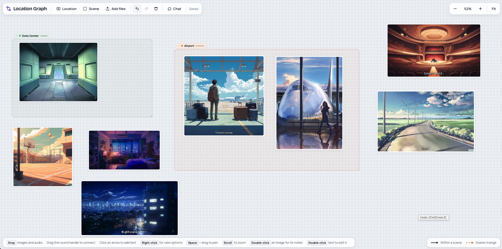

# app-storyboard

A local storyboard editor for planning visual stories such as 2D games.

## About

Use app-storyboard to plan a story before you build it. You map out where the story takes place, how its places connect, and how one scene leads to the next. You also keep track of its characters and of the look you want. The editor runs on your computer and opens in your browser.

You work on a board, the location graph. Each place in the story is a location: a card with an image, a name, and a subtitle. Scenes are frames that group locations. Arrows connect them: an arrow between two locations is a way from one to the other, and an arrow between two scenes is a scene change.

Next to the board, you keep your characters with their sprites, and a mood deck of images that set the look of the story. A chat lets a local AI model, served by LM Studio, read and change the board with you. Your graphs stay on your machine as plain folders.



## What you can do

- **Lay out the story.** Drop images and sounds on the board, group locations into scenes, and connect them with arrows. Press G for the scene map, which shows how the scenes link.
- **Track your characters.** Give each character a profile picture, a bio, and a row of sprites for each animation, such as walking or standing still. The overview shows how complete each character's sprites are.
- **Set the look.** Collect images in the mood deck. A vision model describes each mood by its colors, visual style, elements, and scene. Copy these descriptions as prompts for new images in the same style.
- **Plan with an AI assistant.** Ask the chat to create, connect, move, or resize locations and scenes. Its edits appear on the board at once, and one Undo reverts a whole reply.
- **Keep several graphs.** Create, load, and rename graphs from the graph title in the toolbar. Each graph is a folder in `data/graphs/`. Copy the folder to back up or share the graph.

## Getting started

You need [Node.js](https://nodejs.org/) 24 or later with npm, and [just](https://github.com/casey/just). `just init` also expects the code-checking tools [Semgrep](https://semgrep.dev/), [codespell](https://github.com/codespell-project/codespell), the [CodeQL CLI](https://codeql.github.com/), [Gitleaks](https://github.com/gitleaks/gitleaks), [ShellCheck](https://www.shellcheck.net/), and [shfmt](https://github.com/mvdan/sh).

```bash
just init    # install dependencies and create config/server.env
just start   # build the app, start it, and open it in your browser
just stop    # stop the app
```

The chat and the mood descriptions need [LM Studio](https://lmstudio.ai/) with its local server running and a model loaded: one that uses tools for the chat, and a vision model for the moods. `config/server.env` holds the address of LM Studio, which `just init` sets to `http://127.0.0.1:1234`.

## Development

[AGENTS.md](AGENTS.md) describes the architecture, the HTTP API, the data format, and the rules for changes. Run `just test` for the tests, `just ci` for every check, and `just help` for all commands.

## License

MIT License. See [LICENSE](LICENSE).
